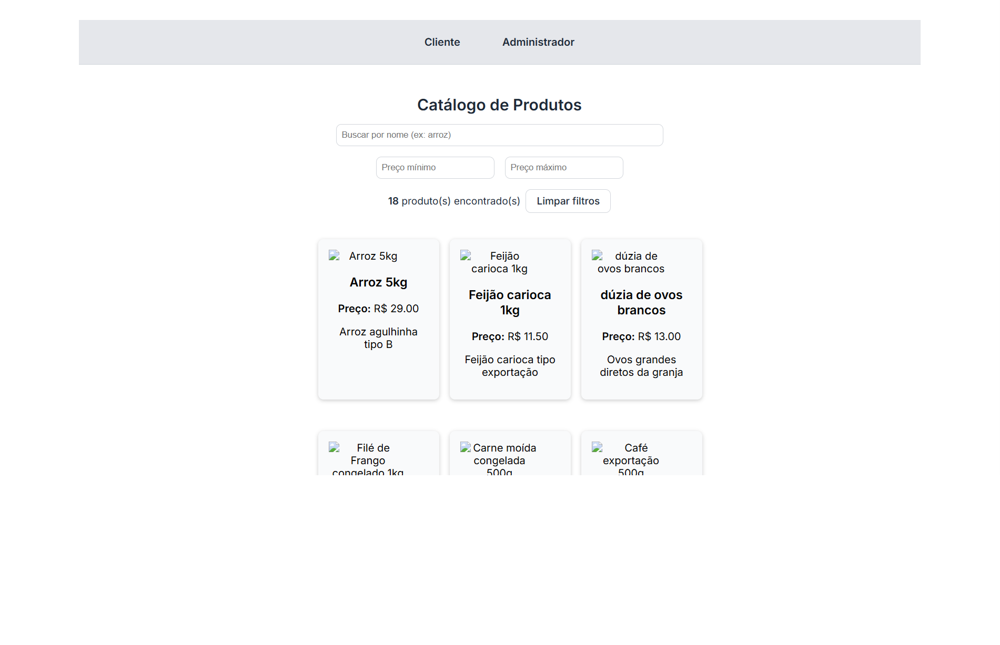

# 🛒 Supermercado Online

Uma aplicação React com TypeScript que simula um sistema de supermercado com duas interfaces principais: uma área pública para os clientes visualizarem produtos e uma área administrativa para gerenciar o catálogo. O backend é simulado utilizando `json-server`.

Observação: A funcionalidade completa depende de um backend local (JSON Server).
No Vercel, apenas a interface visual está disponível.

---

## ✨ Funcionalidades

- ✅ Visualização de produtos (cliente)
- ✅ Adição de novos produtos (admin)
- ✅ Edição de produtos existentes (admin)
- ✅ Exclusão de produtos (admin)
- ✅ Integração com `json-server` para simular um backend completo

---

## 📌 Objetivo

Este projeto foi desenvolvido com os seguintes propósitos:

- Praticar o uso de React com TypeScript
- Trabalhar com consumo de APIs REST (GET, POST, PUT, DELETE)
- Refatorar código com componentização
- Estilizar com abordagem mobile first usando CSS Modules
- Simular um backend usando JSON Server
- Expandir o portfólio pessoal com um projeto completo e funcional

---

## 🚀 Tecnologias Utilizadas

- **React**
- **TypeScript**
- **CSS Modules** 
- **JSON Server** (como backend fake)
- **UUID** (para geração de IDs únicos)

---

## 🧭 Rotas da Aplicação

| Rota       | Descrição                                                         |
|------------|-------------------------------------------------------------------|
| `/`        | Página pública de cliente. Lista os produtos disponíveis.        |
| `/admin`   | Painel administrativo. Permite adicionar, editar e remover itens.|

---

## 📷 Print da Interface

 
 ```
🛠️ Como rodar o projeto localmente
1. Clone o repositório
git clone  https://github.com/GleberC/supermercado.git
cd supermercado-online
2. Instale as dependências
npm install
3. Inicie o JSON Server
npx json-server --watch db.json --port 3001
4. Rode o projeto React
npm run dev
A aplicação estará disponível em: http://localhost:5173

├── public/
├── src/
│   ├── components/
│   │   ├── ProductCard.tsx
│   │   ├── ProductCard.module.css
│   │   ├── ProductForm.tsx
│   │   ├── ProductForm.module.css
│   ├── pages/
│   │   ├── Home.tsx
│   │   ├── Admin.tsx
│   │   ├── Admin.module.css
│   ├── data/
│   │   └── products.ts
│   ├── App.tsx
│   └── main.tsx
├── db.json         # Arquivo simulado do backend
└── README.md
🤝 Contribuindo
Este projeto é uma base didática. Se quiser estudar, fazer melhorias ou usar como inspiração, sinta-se à vontade para fazer um fork!
```
🔗 Deploy 

[[Supermercado Online]](https://supermercado-bice.vercel.app/)

👤 Autor
Gleber Cagnoni
LinkedIn | Portfólio

